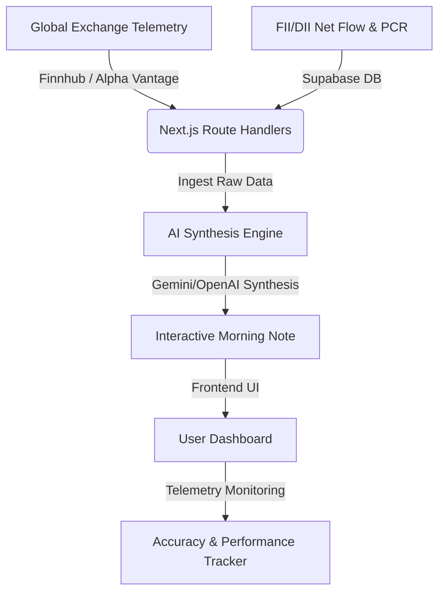

# 📊 Nifty Pulse Terminal

[](https://nextjs.org/)
[](https://tailwindcss.com/)
[](https://supabase.com/)
[](https://aistudio.google.com)

**Nifty Pulse Terminal** is a premium, high-fidelity pre-market intelligence dashboard built for Nifty 50 index and derivatives traders. It aggregates international overnight telemetry, options market metrics, institutional net flows, and macroeconomic events to dynamically synthesize actionable morning pre-market briefings using Gemini and OpenAI generative models.

---

## ⚡ Core Features

- 🤖 **AI Pre-Market Briefing (Morning Note)**: Synthesizes overnight global indicators, FII/DII data, and technical levels into a coherent, daily actionable pre-market report.
- 📉 **Real-Time Telemetry & Overnight Tracker**: Displays live market prices for **GIFT Nifty**, **India VIX** (fear gauge), US index futures, major European indices, Brent Crude, USD/INR, and options Put-Call Ratio (PCR).
- 🎯 **Accuracy Scorecard**: Automatically evaluates historical AI/model predictions against actual market openings, rendering an live session accuracy rating (aiming for >80% precision).
- 📅 **Macroeconomic Calendar & Live News Feed**: Live tracking of market-impacting events and real-time RSS/Atom financial news headlines.
- 🛡️ **Authentication & User Settings**: Uses Supabase for secure login, watchlist storage, and dashboard settings.

---

## 🛠️ Tech Stack

- **Framework**: Next.js 16.2+ (App Router, Server Actions)
- **Styling**: Tailwind CSS v4.0 (Modern styling & layout system)
- **Core State & Icons**: React 19, Lucide React
- **Database & Authentication**: Supabase JS SDK
- **Data Integrations**: Finnhub API (Equities & Indices), Alpha Vantage API (Forex & Commodities)
- **AI Core**: `@google/generative-ai` & `openai` SDKs

---

## ⚙️ Environment Configuration

To run Nifty Pulse Terminal locally or in production, you must set up the following environment variables in your `.env.local` or host dashboard:

```bash
# Supabase Configuration
NEXT_PUBLIC_SUPABASE_URL=https://your-project-id.supabase.co
NEXT_PUBLIC_SUPABASE_ANON_KEY=your_supabase_anon_key

# Live Market Data APIs
FINNHUB_API_KEY=your_finnhub_key_here
ALPHA_VANTAGE_API_KEY=your_alpha_vantage_key_here

# AI Engine Models API Keys
GEMINI_API_KEY=your_gemini_key_here
# (Optional fallback)
OPENAI_API_KEY=your_openai_key_here
```

---

## 🚀 Deployment Status

> [!NOTE]  
> **Production Deployment Active**: This project has been deployed successfully to production. The environment variables listed above are configured in the target environment, ensuring live API polling and database connections remain active.

### Deployment Details
* **Frontend Hosting**: Vercel
* **Database Backend**: Supabase PostgreSQL
* **API Ingestion**: Live background fetching & caching for index futures, forex, and AI prompt generations.

---

## 💻 Local Development Setup

Follow these steps to run a local instance of the terminal:

1. **Clone and Navigate**:
   ```bash
   git clone https://github.com/bhoovan-d/Market_Tracker.git
   cd Market_Tracker
   ```

2. **Install Dependencies**:
   ```bash
   npm install
   ```

3. **Configure Environment Variables**:
   Copy `.env.local.example` to `.env.local` and enter your API keys.
   ```bash
   cp .env.local.example .env.local
   ```

4. **Launch Development Server**:
   ```bash
   npm run dev
   ```
   Open [http://localhost:3000](http://localhost:3000) to view the live dashboard.

5. **Build for Production**:
   ```bash
   npm run build
   npm run start
   ```

---

## 📊 Terminal Architecture


